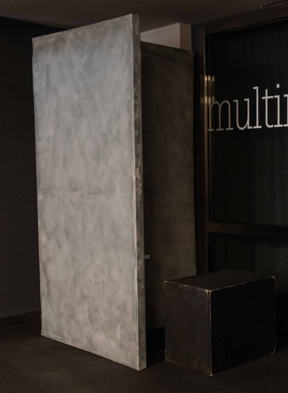

# Dialogues with a Dead Elevator

> *Dialoghi con un ascensore morto*

Documents and source code for the project: "Dialoghi con un ascensore morto" (Dialogues with a Dead Elevator), a **sound installation**.

Artists: Giovanni Santosasi e Gianluca Rubino.

[Download](media/example_sample_1.mp3) or [play](https://soundcloud.com/freccialata/dialogues-dead-elevator?si=ce4c0469b77c427785f98d52daff029f&utm_source=clipboard&utm_medium=text&utm_campaign=social_sharing) an example.

How the installation will look like:

## Subject

The installation is inspired by recordings of the sounds emitted by the elevator of the apartment building where Giovanni Santostasi, one of the artists, lived for most of his life.

As the years passed, the elevator became louder and louder, eventually generating a soundscape composed of recognizable, but always variable, elements. These noises produced by the old "heap of scrap metal" may seem disturbing, but are now linked to nostalgic memories, since the elevator has been replaced. These noises, in fact, represent a particular connection with an artificial space that accompanied the artist's life, but which no longer exists today. During the last phases of activity, the artist captured recordings of this elevator to maintain its memory.

Then, the old recordings are recalled in a sound installation in an attempt to establish an impossible dialogue with the old elevator model. The recorded sounds are transformed and distorted thanks to a distance sensor placed in a structure that evokes an elevator. This sensor reacts to the movements of people, changing the original audio recordings. Sound and performance thus form a sort of digital ritual, with the aim of re-establishing a bond with a space that has now disappeared, but which still retains a strong emotional connection.

It is no coincidence that the selected recorded tracks show how the signs of aging of the old elevator model have become increasingly invasive and noisy, imposing a soundscape that reveals a history, as well as an imminent replacement.
